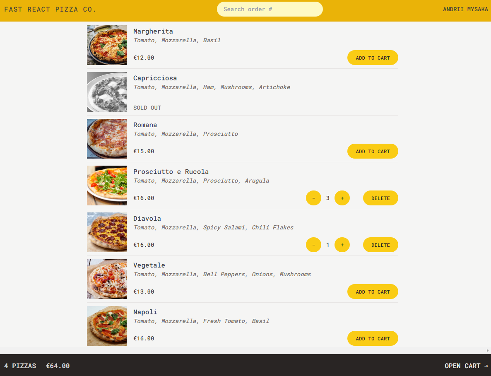

# <a href="https://fast-react-pizza-andrii-mysaka.netlify.app/" target="_blank">Fast-React-Pizza</a>
React Pizza is a single-page web application for ordering pizza online. Built with React and Redux, the app features a responsive design and a user-friendly interface that allows customers to customize their pizza with various toppings and sauces.

Features:

- add pizza to cart, choose quantity of each
- track what you already have in cart
- make order by complete form with phone, address (possible to use geolocation)
- add order to priority queue by paying extra money
- no payment processing

Tech Features:

- application uses backend servise to fetch and post data (remote state)
- that remote state manage by react router data loading feature ("rendre as you fetch") and router action to post data to remote api
- global UI state manage be redux-toolkit, split global state on slices
- styling: Tailwindcss, responsive design (mobile first)

## Tech Stack

    
    
    
    

# Hero

